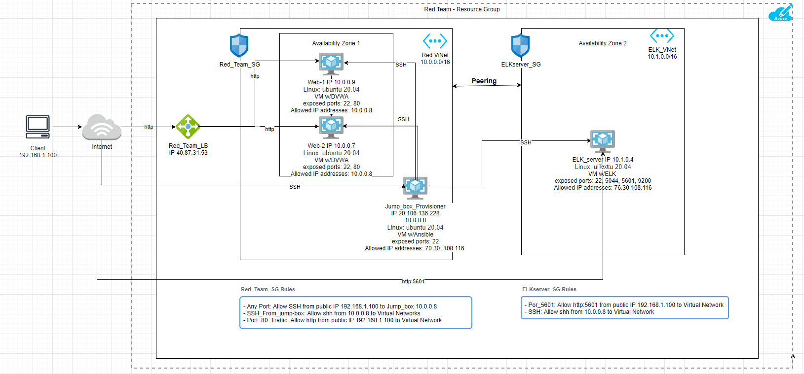
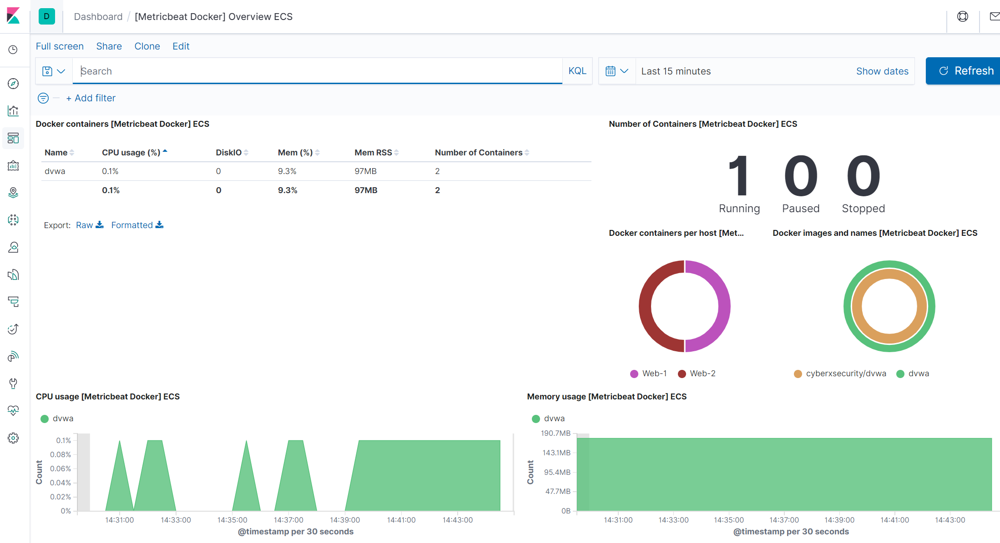

# Project1_ElKStack
## Automated ELK Stack Deployment

The files in this repository were used to configure the network depicted below.



These files have been tested and used to generate a live ELK deployment on Azure. They can be used to either recreate the entire deployment pictured above. Alternatively, select portions of the playbook file may be used to install only certain pieces of it, such as Filebeat.

``` 
---
- name: installing and launching filebeat
  hosts: webservers
  become: yes
  tasks:

  - name: download filebeat deb
    command: curl -L -O https://artifacts.elastic.co/downloads/beats/filebeat/filebeat-7.6.1-amd64.deb

  - name: install filebeat deb
    command: dpkg -i filebeat-7.6.1-amd64.deb

  - name: drop in filebeat.yml
    copy:
      src: /etc/ansible/filebeat-config.yml
      dest: /etc/filebeat/filebeat.yml

  - name: enable and configure system module
    command: filebeat modules enable system

  - name: setup filebeat
    command: filebeat setup

  - name: start filebeat service
    command: service filebeat start

  - name: enable service filebeat on boot
    systemd:
      name: filebeat
      enabled: yes_
``` 
This document contains the following details:
- Description of the Topology
- Access Policies
- ELK Configuration
  - Beats in Use
  - Machines Being Monitored
- How to Use the Ansible Build


### Description of the Topology

The main purpose of this network is to expose a load-balanced and monitored instance of DVWA, the D*mn Vulnerable Web Application.

Load balancing ensures that the application will be highly responsive and available, in addition to restricting access to the network.
- _Load balancers protect against distributed denial-of-service attacks by rerouting traffic to other available servers when a specific server becomes overloaded._
- _Jump box provide a single point of connection to the network so other machines on the network will not be exposed to public internet. It will limit the security settings to a single machine instead of multiple machines such as:_
  - _Implementing a firewall host on jump box_
  - _Implementing log monitoring._
  - _Implementing two-factor ahuthentication for SSH login to the jump box._

Integrating an ELK server allows users to easily monitor the vulnerable VMs for changes to the file system and system metrics.
- _Filebeat watch for/collect log files from very specific files such as Mircosoft Azure tools, Nginx web server, Apache or MySQL databases._
- _Metricbeat record metrics and statistics for a system or services such as CPU  or memory usages, NGINX..._

The configuration details of each machine may be found below:

| Name       | Function   | IP Address | Operating System |
|------------|------------|------------|------------------|
| Jump Box   | Gateway    | 10.0.0.8   | Linux            |
| Web-1      | Web server | 10.0.0.9   | Linux            |
| Web-2      | Web server | 10.0.0.7   | Linux            |
| ELK_server | ELK server | 10.1.0.4   | Linux            |
| Red_Team_LB| load balancer | 40.7.31.53| Linux          |

### Access Policies

The machines on the internal network are not exposed to the public Internet. 

Only the Elk server and Jump Box machines can accept connections from the Internet. Access to these machine is only allowed from the following IP addresses:
- _192.168.1.100_

Machines within the network can only be accessed by other internal machines.
- _Web-1, Web-2 and jump box are allowed to access your ELK VM._
- _Their IP addresses are:_
  -  10.0.0.9
  -  10.0.0.7
  -  10.0.0.8

A summary of the access policies in place can be found in the table below.
| Name     | Publicly Accessible | Allowed IP Addresses |
|----------|---------------------|----------------------|
| Jump Box | Yes                 | 192.168.1.100        |
| Web-1    | No                  | 10.0.0.8             |
| Web-2    | No                  | 10.0.0.8             |
| load balancer | Yes            | 192.168.1.100        |
| ELK server | Yes               | 192.168.1.100:5601   |                    

### Elk Configuration

Ansible was used to automate configuration of the ELK machine. No configuration was performed manually, which is advantageous because similar configuration can be used to configure newely added machine. Also, if an update is required the relevant playbook folders can be updated and pushed on multiple machines at once.

The playbook implements the following tasks:
- _Use apt module to install docker.io and python3-pip_
- _Use pip module to install Docker module_
- _Use command module to increase virtual memory_
- _Download and launch docker Elk container_
- _Enable docker service_

The following screenshot displays the result of running `docker ps` after successfully configuring the ELK instance.


### Target Machines & Beats
This ELK server is configured to monitor the following machines:
- _10.0.0.9_
- _10.0.0.7_

We have installed the following Beats on these machines:
- _Filebeat & Metricbeat_

These Beats allow us to collect the following information from each machine:
- _'Filebeat' is often used to collect log files. We used it to collect and parse logs created by the system logging service of Web-1 and Web-2 which are Linux based_
- _'Metricbeat'  module collects and fetches metrics from  systems and services. Metricbeat was used to monitor CPU and memory usages._

### Using the Playbook
In order to use the playbook, you will need to have an Ansible control node already configured. Assuming you have such a control node provisioned: 

SSH into the control node and follow the steps below:
- Copy the playbook file "filebeat-playbook.ym" to the relevant location in the project. In this case the file was copied to the "roles" directory listed in /etc/ansible/roles/.
- Update the configuraiton file "filebeat-config.yml" to include:
  - username & password
  - The host IP address: _10.1.0.4:9200_
  - Kibana end point configuration host IP: _10.1.0.4:5601_
 - To specify where ELK server vs. Filebeat are installed, this is identified in Playbook yaml file (hosts were identified as "webservers" for filebeat, but "elk" for ELK server as shown below).
```
# location where to install filebeat
---
- name: installing and launching filebeat
  hosts: webservers
  become: yes
  tasks:
...
```

```
# location where to install ELK server
---
- name: Configure Elk VM with Docker
  hosts: elk
  remote_user: azadmin
  become: true
  tasks:
  ...
  ```
  - Run the playbook, and navigate to //http://40.77.108.39:5601/app/kibana#/home
  - Navigate to the filebeat installation page on the ELK server GUI
  - Scroll to the bottom of the page and click Verify incoming data and you should see the following:


_The specific commands the user will need to run to download the playbook, update the files, etc... are_
- First download the filebeat configuration template by running the following curl "curl https://gist.githubusercontent.com/slape/5cc350109583af6cbe577bbcc0710c9
3/raw/eca603b72586fbe148c11f9c87bf96a63cb25760/Filebeat >/etc/ansible/filebeat‐config.yml"
- Next the configuration file will need to be updated to include: username and password, ELK server IP address on lines 1106, and 1806.
- Then update the fileat playbook yml file with the relevant commands i.e.:
  - Install the filebeat deb "curl -L -O https://artifacts.elastic.co/downloads/beats/filebeat/filebeat-7.6.1-amd64.deb"
  - Install the .deb package "dpkg ‐i filebeat‐7.4.0‐amd64.deb"
  - drop in filebeat.yml "dest: /etc/filebeat/filebeat.yml"
  - Enable and configure system module "filebeat modules enable system"
  - setup filebeat "filebeat setup"
  - start filebeat "service filebeat start"
  - ...
- Next you will need to run the playbook "ansible-playbook filebeat_playbook.yml"
- Now you can check the results on Kibana GUI to verify changes took place. Below is a screen shot of the metricbeat that was completed in addition fo the filebeat with very similar steps were followed:


